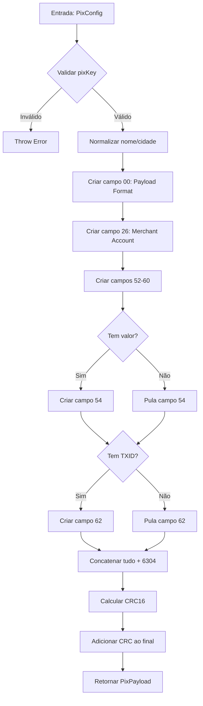

# Pix Copia e Cola

## Como Funciona Internamente

### Padrão EMV-Co

Todo campo EMV segue a estrutura:

```
ID (2 dígitos) | TAMANHO (2 dígitos) | VALOR
```

**Exemplo:**
```
59 10 FULANO TEC
│  │  └─ Valor (10 caracteres)
│  └─ Tamanho (10)
└─ ID do campo (59 = Nome do recebedor)
```

### Campos do Pix (IDs EMV)

| ID | Campo | Valor | Descrição |
|----|-------|-------|-----------|
| 00 | Payload Format | "01" | Versão do payload (sempre "01") |
| 26 | Merchant Account | GUI + Chave | Informações do recebedor |
| 52 | Category | "0000" | Categoria (sempre "0000") |
| 53 | Currency | "986" | Moeda (986 = BRL - Real brasileiro) |
| 54 | Amount | "49.90" | Valor da transação (opcional) |
| 58 | Country | "BR" | País (Brasil) |
| 59 | Merchant Name | Nome | Nome do recebedor (máx. 25 chars) |
| 60 | Merchant City | Cidade | Cidade (máx. 15 chars) |
| 62 | Additional Data | TXID | Dados adicionais (TXID, descrição) |
| 63 | CRC16 | 4 hex | Checksum do payload |

### Estrutura do Campo 26 (Merchant Account)

Dentro do campo 26, há subcampos:

```
26 [tamanho] [subcampos]
  └─ 00 14 BR.GOV.BCB.PIX  (GUI oficial do Pix)
  └─ 01 [tam] [chave-pix]  (Sua chave Pix)
  └─ 02 [tam] [descrição]  (Opcional)
```

### Exemplo de Payload Completo

```
00020126360014BR.GOV.BCB.PIX0114123456789005204000053039865802BR5912FULANO TEC6007MARILIA6304A737
```

Decompondo:

```
0002  01                           → Payload Format Indicator
26    36                           → Merchant Account (36 caracteres)
  00  14  BR.GOV.BCB.PIX          → GUI do Pix
  01  11  12345678900             → Chave Pix
5204  0000                         → Categoria
5303  986                          → Moeda BRL
5802  BR                           → País
59    12  FULANO TEC            → Nome
60    07  MARILIA                 → Cidade
6304  A737                         → CRC16
```

---

## Algoritmo CRC16-CCITT

### Especificação

- **Algoritmo:** CRC16-CCITT
- **Polinômio:** 0x1021
- **Valor inicial:** 0xFFFF
- **XOR final:** Não aplicado
- **Saída:** 4 caracteres hexadecimais MAIÚSCULOS

### Implementação

```typescript
function calculateCRC16(payload: string): string {
  let crc = 0xFFFF;                // Valor inicial
  const polynomial = 0x1021;       // Polinômio CCITT

  for (let i = 0; i < payload.length; i++) {
    crc ^= (payload.charCodeAt(i) << 8);
    
    for (let j = 0; j < 8; j++) {
      if (crc & 0x8000) {
        crc = (crc << 1) ^ polynomial;
      } else {
        crc = crc << 1;
      }
    }
  }

  crc = crc & 0xFFFF;
  return crc.toString(16).toUpperCase().padStart(4, '0');
}
```

### Como o CRC é Calculado

1. Monta o payload completo **SEM** o CRC
2. Adiciona `6304` no final (ID 63 + tamanho 04)
3. Calcula o CRC16 sobre essa string completa
4. Adiciona o CRC (4 chars hex) no final

**Exemplo:**
```
Payload sem CRC: 00020126...MARILIA6304
                                    └─ placeholder
Calcula CRC: A737
Payload final: 00020126...MARILIA6304A737
                                      └─ CRC real
```

---

## Validações Implementadas

### 1. Chave Pix

**Tipos de chave aceitos:**
- CPF: `12345678900`
- CNPJ: `12345678000190`
- Email: `usuario@dominio.com.br`
- Telefone: `+5514998765432`
- Chave aleatória: `a1b2c3d4-e5f6-7890-abcd-ef1234567890`

### 2. Nome do Recebedor

**Exemplos de normalização:**
- `"José da Silva"` → `"JOSE DA SILVA"`
- `"Café & Cia."` → `"CAFE CIA"`
- `"Açaí 100%"` → `"ACAI 100"`

### 3. Cidade

Mesma lógica do nome, mas limitado a 15 caracteres.

### 4. Valor

**Limites:**
- Mínimo: 0.01 (1 centavo)
- Máximo: 999.999.999,99

---

## Arquitetura do Código

### Funções Auxiliares

```
createEMVField()          → Cria um campo EMV (ID + Tamanho + Valor)
calculateCRC16()          → Calcula checksum CRC16-CCITT
normalizeMerchantName()   → Normaliza nome (remove acentos, etc)
normalizeMerchantCity()   → Normaliza cidade
validatePixKey()          → Valida chave Pix
formatAmount()            → Formata valor monetário
```

### Função Principal

```
gerarPixCopiaCola()
  │
  ├─ Valida inputs
  ├─ Normaliza strings
  ├─ Cria campos EMV
  ├─ Monta payload
  ├─ Calcula CRC16
  └─ Retorna objeto com payload e info
```

### Fluxo de Execução



---

## Testes Unitários

### Cobertura: 100%

Todos os testes estão em `tests/pixCopiaCola.test.ts`

### Categorias de Testes

#### 1. Testes de Geração
- ✅ Payload básico sem valor
- ✅ Payload com valor fixo
- ✅ Payload com TXID
- ✅ Payload completo (todos os campos)
- ✅ Diferentes tipos de chave (CPF, email, telefone, aleatória)

#### 2. Testes de Normalização
- ✅ Remoção de acentos (`José` → `JOSE`)
- ✅ Remoção de caracteres especiais (`Café & Cia` → `CAFE CIA`)
- ✅ Truncamento de strings longas
- ✅ Conversão para maiúsculas

#### 3. Testes de Validação
- ✅ Chave Pix vazia → erro
- ✅ Chave muito longa → erro
- ✅ Nome inválido → erro
- ✅ Cidade inválida → erro
- ✅ Valor zero/negativo → erro
- ✅ Valor muito alto → erro

#### 4. Testes de CRC16
- ✅ CRC sempre tem 4 caracteres hex
- ✅ CRCs diferentes para payloads diferentes
- ✅ Validação de payload correto
- ✅ Rejeição de payload com CRC errado

#### 5. Testes de Formato EMV
- ✅ Começa com `000201`
- ✅ Contém GUI `BR.GOV.BCB.PIX`
- ✅ Categoria `0000`
- ✅ Moeda `986` (BRL)
- ✅ País `BR`

#### 6. Casos de Uso Reais
- ✅ E-commerce (venda de produto)
- ✅ Doação (sem valor fixo)
- ✅ Cobrança mensal

---

## 🔒 Segurança

### O que NÃO é enviado para servidores:

- ✅ Chave Pix
- ✅ Valores das transações
- ✅ Informações pessoais
- ✅ Nada! Tudo é processado localmente

### Características de Segurança:

1. **Zero dependências externas** → Sem supply chain attacks
2. **Código aberto** → Auditável por qualquer um
3. **Processamento local** → Nenhum dado sai do dispositivo
4. **Sem criptografia** → Payload é texto plano (padrão do BC)
5. **Validações rigorosas** → Previne erros de formato

### Payload Pix é Seguro?

**Sim!** O payload Pix:
- Não contém senha ou dados sensíveis
- É apenas um texto formatado
- Segue padrão público do Banco Central
- Pode ser compartilhado livremente
- Não permite reversão de pagamento
- Não expõe dados bancários

---

## 🌐 Compatibilidade

### Navegadores

- ✅ Chrome/Edge 90+
- ✅ Firefox 88+
- ✅ Safari 14+
- ✅ Opera 76+
- ✅ Todos os navegadores mobile modernos

### Node.js

- ✅ Node.js 14+
- ✅ Node.js 16 (LTS)
- ✅ Node.js 18 (LTS)
- ✅ Node.js 20 (Current)

### TypeScript

- ✅ TypeScript 4.5+
- ✅ TypeScript 5.0+

---

## 📚 Referências Oficiais

### Banco Central do Brasil

- [Manual do Pix](https://www.bcb.gov.br/estabilidadefinanceira/pix)
- [Especificação BR Code](https://www.bcb.gov.br/content/estabilidadefinanceira/pix/Regulamento_Pix/II_manual_usuario_BR_Code.pdf)
- [Padrões e Especificações](https://www.bcb.gov.br/estabilidadefinanceira/pixespecificacoes)

### EMV-Co

- [QR Code Specification](https://www.emvco.com/emv-technologies/qrcodes/)
- [EMV QR Code Merchant Presented Mode](https://www.emvco.com/wp-content/uploads/documents/EMVCo-Merchant-Presented-QR-Specification-v1-1.pdf)

### CRC16-CCITT

- [Wikipedia - CRC](https://en.wikipedia.org/wiki/Cyclic_redundancy_check)
- [CRC16-CCITT Calculator](https://www.lammertbies.nl/comm/info/crc-calculation)

---

## 🛠️ Desenvolvimento

### Adicionar Novo Campo

```typescript
// Exemplo: adicionar campo customizado
function gerarPixCopiaCola(config: PixConfig): PixPayload {
  // ... código existente ...
  
  // Adicionar novo campo (exemplo: campo 61)
  const newField = createEMVField('61', 'VALOR_CUSTOMIZADO');
  
  let payload = 
    payloadFormat +
    merchantAccount +
    // ... outros campos ...
    newField +  // Novo campo
    '6304';
  
  // ... resto do código ...
}
```

### Modificar Validação

```typescript
// Em pixCopiaCola.ts
function validatePixKey(key: string): void {
  // Adicionar nova regra
  if (key.startsWith('INVALID')) {
    throw new Error('Chave Pix com prefixo inválido');
  }
  
  // ... validações existentes ...
}
```

### Adicionar Teste

```typescript
// Em tests/pixCopiaCola.test.ts
it('deve rejeitar chave com prefixo inválido', () => {
  expect(() => {
    gerarPixCopiaCola({
      pixKey: 'INVALID-KEY',
      merchantName: 'TESTE',
      merchantCity: 'CIDADE',
    });
  }).toThrow('Chave Pix com prefixo inválido');
});
```

---

## 🐛 Debugging

### Visualizar Payload Decomposto

```typescript
function debugPayload(payload: string) {
  let pos = 0;
  
  while (pos < payload.length - 4) { // -4 para não processar o CRC
    const id = payload.substring(pos, pos + 2);
    const len = parseInt(payload.substring(pos + 2, pos + 4));
    const value = payload.substring(pos + 4, pos + 4 + len);
    
    console.log(`Campo ${id}: [${len} chars] "${value}"`);
    pos += 4 + len;
  }
  
  const crc = payload.slice(-4);
  console.log(`CRC: ${crc}`);
}

// Uso
const pix = gerarPixCopiaCola({...});
debugPayload(pix.payload);
```

**Saída esperada:**
```
Campo 00: [2 chars] "01"
Campo 26: [36 chars] "0014BR.GOV.BCB.PIX011112345678900"
Campo 52: [4 chars] "0000"
Campo 53: [3 chars] "986"
Campo 58: [2 chars] "BR"
Campo 59: [12 chars] "FULANO TEC"
Campo 60: [7 chars] "MARILIA"
CRC: A737
```

---

## 💡 Dicas

### Gerar QR Code

```javascript
// Use uma lib de QR Code
import QRCode from 'qrcode';

const pix = gerarPixCopiaCola({...});
QRCode.toDataURL(pix.payload, (err, url) => {
  // url é uma imagem base64
  document.getElementById('qrcode').src = url;
});
```

### Integração com React

```jsx
import { gerarPixCopiaCola } from 'pix-copia-e-cola-ts';
import { useState } from 'react';

function PixGenerator() {
  const [payload, setPayload] = useState('');
  
  const handleGenerate = (amount) => {
    const pix = gerarPixCopiaCola({
      pixKey: process.env.REACT_APP_PIX_KEY,
      merchantName: 'MINHA LOJA',
      merchantCity: 'SAO PAULO',
      amount: amount,
    });
    
    setPayload(pix.payload);
  };
  
  return <div>{payload}</div>;
}
```
